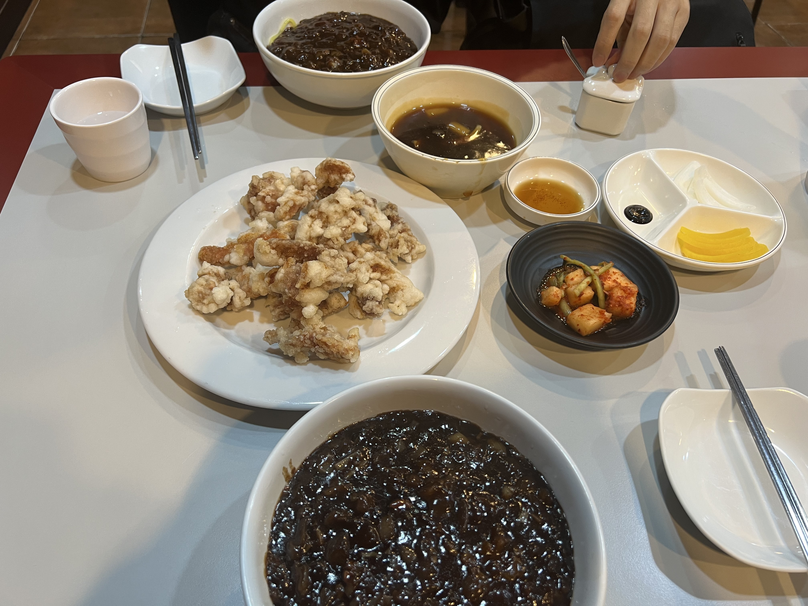

# 맛집 리스트

## 한식

☆★
* 연가 (★★★★★)
    * 식당링크 
     !(https://map.naver.com/v5/search/%EC%97%AD%EC%82%BC%EC%97%AD%20%EC%97%B0%EA%B0%80/place/35278680?placePath=%3Fentry%253Dpll&c=15,0,0,0,dh)
     
        

     * **집밥** 맛을 느낄 수 있음 (자취하는 사람들 강추!) 
     * 반찬(계란말이, 소세지볶음) 무한리필됨!
        

* 심가네칼국수 (★★★★★)
    * 식당링크
    !(https://map.naver.com/v5/search/%EC%97%AD%EC%82%BC%EC%97%AD%20%EC%8B%AC%EA%B0%80%EB%84%A4%EC%B9%BC%EA%B5%AD%EC%88%98/place/36628829?placePath=%3Fentry=pll%26from=nx%26fromNxList=true&c=15,0,0,0,dh)

    * 콩국수 강추 (설탕도 있음) 아재들 추천!

       

* 닭갈비두목 (★★★★☆)
    * 식당링크
    !(https://map.naver.com/v5/entry/place/1747839887?lng=127.0377029354211&lat=37.49628382698332&placePath=%2Fhome&entry=plt&c=15,0,0,0,dh)

       

    * 맛은 있는데 그냥 양 많은 닭갈비 

## 중식

* 양자강 (★★★★☆)
    * 식당링크
    !(https://map.naver.com/v5/search/%EC%97%AD%EC%82%BC%EC%97%AD%20%EC%A7%9C%EC%9E%A5%EB%A9%B4/place/18592524?n_ad_group_type=10&n_query=%EC%97%AD%EC%82%BC%EC%97%AD%EC%A7%9C%EC%9E%A5%EB%A9%B4&c=17.56,0,0,0,dh)

       
    * 거리가 가깝고 가격 적당한듯 

## 일식 

* 카즈야 (★★★★☆)
    * 식당링크 
    !(https://map.naver.com/v5/search/%EC%97%AD%EC%82%BC%EC%97%AD%20%EB%8F%88%EA%B9%8C%EC%8A%A4/place/86771976?c=15,0,0,0,dh)

       
    * 생선까스가 맛있음(개인적으로좋아함)

    

## 양식
    * 아직없음dd
    

## 가볼 곳 
이도곰탕
신동궁감자탕
오성식당
역삼역 서울집( 만두전골)    